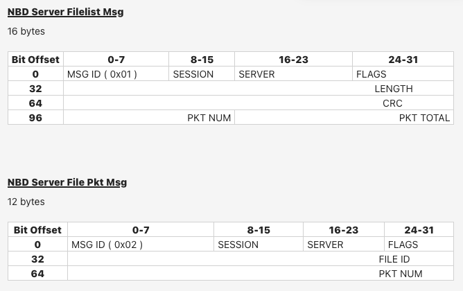

Panasonic has a small header when distributing files over multicast.

It's broadcast from NBD server to NBD clients on seatbacks.

# installation

    cp pac-nbd.lua ${XDG_CONFIG_DIR:-${HOME}/.config}/wireshark/plugins/

# development

command-shift-L is your friend

# format

